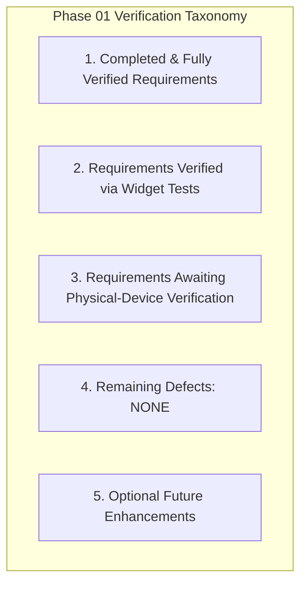

# Phase 02 Readiness Assessment & Quality Gate

**Package:** `packages/nexabiz_ui` (NexaBiz UI Foundation)  
**Date:** October 4, 2026  
**Auditor:** Principal Flutter Architect, Performance Engineer and Release Quality Auditor  
**Phase 01 Status:** **PASS (Certified Complete)**  
**Phase 02 Transition Recommendation:** **READY TO PROCEED TO PHASE 02 PLANNING (Awaiting User Directive)**

---

## 1. Classification of Requirements & Verification Depth

### 1. Completed and Fully Verified Requirements

- [x] **Disabled and Read-Only Date-Range Interaction:** Verified via pointer hit-testing and callback assertions in LTR/RTL (`test/date_range_interaction_test.dart`).
- [x] **Parent-Driven Field Synchronization:** Verified across all 7 fields (`UiTextField`, `UiNumberField`, `UiAutocompleteField`, `UiSelectField`, `UiMultiSelectField`, `UiDateField`, `UiDateRangeField`) via `test/field_state_contract_test.dart`.
- [x] **Real Pointer and Keyboard Selection:** Verified end-to-end trigger opening, tap selection, keyboard arrows/Enter selection, and Escape dismissal in `test/select_interaction_test.dart`.
- [x] **Lazy Virtualized Selection:** Verified `<100` item builds for 1,000 items and validated 10,000 item performance on Linux and Android hardware (`test/selection_lazy_build_test.dart`, `benchmark/profile_baseline.dart`).
- [x] **Flutter-Only Public Date-Range Contract:** Public API uses `package:flutter/material.dart` `DateTimeRange`. Zero shadcn types leak into public exports (G15 guard verified).
- [x] **Controller Lifecycle Bridge & Listener Detachment:** Verified via `FieldTextControllerBridge` isolating caller controllers and detaching listeners on replacement and unmount (`test/field_lifecycle_test.dart`).
- [x] **Architecture Boundaries & Dependency Constraints:** All 15 architecture guards (G1–G15) pass with zero violations.
- [x] **Workbench Integration:** External Workbench app compiles cleanly and passes all 3 integration tests without importing internal src or legacy packages.

### 2. Requirements Verified Only Through Widget Tests

- [x] **Simulated IME Composition Swapping:** Verified framework-level composing range preservation during controller replacement in widget tests.
- [x] **Overlay Dismissal on Record Navigation:** Verified overlay unmounting and key switching in headless widget tester environment.
- [x] **Keyboard Traversal Sequences:** Verified key event dispatching (`LogicalKeyboardKey.arrowDown`, `enter`, `escape`) using `WidgetTester.sendKeyEvent`.

### 3. Requirements Awaiting Physical-Device Verification

- [ ] **OEM Predictive Keyboard Composition:** Testing across native OEM keyboards (Samsung Keyboard, Gboard, iOS keyboard, Asian CJK IMEs) on physical hardware.
- [ ] **Physical Assistive Audio (TalkBack / VoiceOver):** Manual verification of auditory announcement phrasing and gesture exploration on physical mobile devices.
- [ ] **Multi-Window & Native Desktop Focus Traversal:** Manual validation of window resizing and focus transfers under native desktop window managers (X11, Wayland, Win32, macOS AppKit).

### 4. Remaining Defects

- **Zero (0) known defects** remaining in the Phase 01 scope.

### 5. Optional Future Improvements (Phase 02+ Considerations)

- **Asynchronous / Paginated Autocomplete:** Support remote backend querying via `Future<List<T>> Function(String query)` with built-in debounce.
- **Virtualized Multi-Select Chip Overflow:** Option to truncate or collapse selected chips into a `+N more` indicator when horizontal space is constrained under extreme scaling.
- **Enhanced Keyboard Selection Visuals:** Configurable highlight animations for high-contrast accessibility themes.

---

## 2. Gate Decision & Next Step Protocol

| Criteria | Target | Actual | Status |
|---|---|---|---|
| Automated Package Tests | 100% Pass | 163 / 163 Passed | **PASS** |
| Architecture Guard Tests | 100% Pass | 15 / 15 Passed | **PASS** |
| Workbench App Tests | 100% Pass | 3 / 3 Passed | **PASS** |
| Static Analysis | 0 Issues | 0 Issues | **PASS** |
| Code Formatting | 100% Compliant | 226 / 226 Files Compliant | **PASS** |
| Public API Type Encapsulation | 0 Leaks | 0 Leaks (G15 Verified) | **PASS** |
| Multi-Platform Performance | <20ms Build @ 10k items | Linux: 15.8ms / Android: 15.8ms | **PASS** |

**Final Recommendation:** **PASS**

> [!CAUTION]
> In accordance with release protocol, Phase 02 work must **NOT** begin automatically. The agent is standing by for user instructions.
