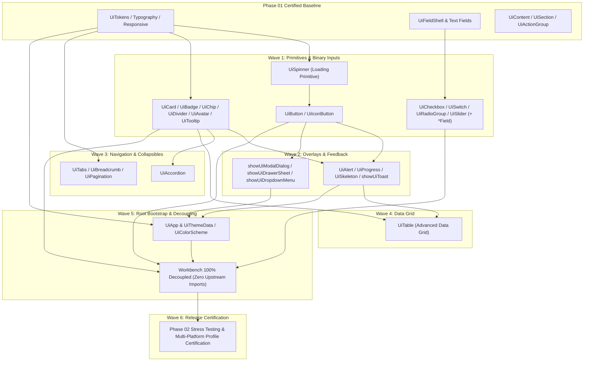

# Phase 02 — Component Implementation Plan & Ordered Roadmap (Revised)

**Package:** `packages/nexabiz_ui` (NexaBiz UI Foundation)  
**Author:** Principal Flutter Architect, Design System Engineer and Reusable Package Architect  
**Mode:** Implementation Plan & Step-by-Step Roadmap  
**Status:** Approved Roadmap (Planning Only — Do Not Implement Automatically)  

---

## 1. Implementation Philosophy & Work Division

To ensure maximum release quality, prevent architectural regressions, and uphold the certified Phase 01 performance baselines, Phase 02 is organized into **6 discrete sequential waves** comprising **10 verifiable implementation steps**.

Each step follows the strict engineering cycle:
```text
INSPECT UPSTREAM → DESIGN & HARNESS → IMPLEMENT CANONICAL CONTRACT → VERIFY G1-G15 & LTR/RTL → MIGRATE WORKBENCH
```

---

## 2. Definitive Component Dependency Graph



> **Critical Ordering Correction:** `UiSpinner` is positioned as a Step 02 foundational primitive alongside `UiButton`. This resolves the dependency inversion where `UiButton.isLoading` previously required a component from Step 05.

---

## 3. Detailed Step-by-Step Roadmap & Acceptance Criteria

### Step 02: Action Controls & Primitive Loading Indicators
- **Deliverables:**
  - `packages/nexabiz_ui/lib/src/actions/button.dart` (`UiButton`, `UiButtonVariant`, `UiButtonSize`).
  - `packages/nexabiz_ui/lib/src/actions/icon_button.dart` (`UiIconButton`).
  - `packages/nexabiz_ui/lib/src/feedback/spinner.dart` (`UiSpinner`).
- **Dependencies:** `UiTokens` (Phase 01 certified).
- **Acceptance Criteria:**
  1. `UiButton` supports `primary`, `secondary` (outline), `ghost`, `destructive`, and `link` variants.
  2. `UiButton.isLoading = true` displays `UiSpinner` without jumping or altering button dimensions.
  3. `UiIconButton` requires `semanticLabel` and supports optional tooltip.
  4. Activates via pointer tap and keyboard (`Enter`, `Space`).
  5. 100% test pass in LTR and RTL under `test/actions/button_test.dart`.
  6. Zero upstream `shadcn` types exposed in public exports (Guard G15).
  7. `UiSpinner.semanticLabel` and all `UiButton.loadingSemanticLabel` constructors
     accept caller-localized text; omitted loading text retains the button label.
     Nested progress must not duplicate the button's semantics.

### Step 03: Surfaces, Badges, Separators & Display Elements
- **Deliverables:**
  - `packages/nexabiz_ui/lib/src/display/card.dart` (`UiCard`).
  - `packages/nexabiz_ui/lib/src/display/badge.dart` (`UiBadge`, `UiBadgeVariant`).
  - `packages/nexabiz_ui/lib/src/display/chip.dart` (`UiChip`).
  - `packages/nexabiz_ui/lib/src/display/divider.dart` (`UiDivider`, `UiDividerOrientation`).
  - `packages/nexabiz_ui/lib/src/display/avatar.dart` (`UiAvatar`, `UiAvatarSize`).
  - `packages/nexabiz_ui/lib/src/display/tooltip.dart` (`UiTooltip`).
- **Dependencies:** `UiTokens`, `UiLayoutTier`.
- **Acceptance Criteria:**
  1. `UiCard` provides structured slots (`title`, `description`, `header`, `footer`, `actions`, `child`) with responsive token padding.
  2. `UiChip` provides interactive pill with optional `onPressed` and independently keyboard-operable `onDeleted`; a non-empty caller-localized `deleteSemanticLabel` is required for deletion.
  3. `UiBadge` renders distinct status variants (`primary`, `secondary`, `outline`, `destructive`).
  4. `UiDivider` renders horizontal and vertical modes, decorative by default with optional caller-supplied semantic text (no unsupported separator role).
  5. `UiAvatar` extracts initials automatically when no image is supplied.
  6. `UiTooltip` uses caller-localized text and opens on hover, focus or long-press, with dismissal and overlay lifecycle coverage.
  7. Tested across `TextScaler.linear(1.5)` and `TextScaler.linear(2.0)` with zero overflows.

### Step 04: Binary & Choice Form Inputs
- **Deliverables:**
  - `packages/nexabiz_ui/lib/src/fields/checkbox_field.dart` (`UiCheckbox`, `UiCheckboxField`).
  - `packages/nexabiz_ui/lib/src/fields/switch_field.dart` (`UiSwitch`, `UiSwitchField`).
  - `packages/nexabiz_ui/lib/src/fields/radio_group_field.dart` (`UiRadioGroup<T>`, `UiRadioGroupField<T>`, `UiRadioOption<T>`).
  - `packages/nexabiz_ui/lib/src/fields/slider_field.dart` (`UiSlider`, `UiSliderField`).
- **Dependencies:** `UiFieldShell` (Phase 01 certified).
- **Acceptance Criteria:**
  1. `UiCheckbox` strictly hides upstream `CheckboxState`, exposing pure `bool? value` (and `tristate` support).
  2. `UiSlider` strictly hides upstream `SliderValue`, exposing canonical `double value` (`min`, `max`, `divisions`).
  3. Standalone widgets provide pure control presentation; `*Field` widgets embed inside `UiFieldShell` with label, helper, and error live regions.
  4. State synchronization verified: updates immediately when parent rebuilds (`didUpdateWidget`).
  5. Keyboard interaction: `Space` toggles checkbox/switch; arrow keys traverse radio group options.
  6. Tested in `test/fields/binary_fields_test.dart`.

### Step 05: Feedback, Notifications & Skeletons
- **Deliverables:**
  - `packages/nexabiz_ui/lib/src/feedback/alert.dart` (`UiAlert`, `UiAlertSeverity`).
  - `packages/nexabiz_ui/lib/src/feedback/progress.dart` (`UiProgress`).
  - `packages/nexabiz_ui/lib/src/feedback/skeleton.dart` (`UiSkeleton`).
  - `packages/nexabiz_ui/lib/src/feedback/toast.dart` (`showUiToast`, `UiToastLayer`, `UiToastType`).
- **Dependencies:** `UiTokens`, `UiButton`.
- **Acceptance Criteria:**
  1. `showUiToast` presents non-blocking alert banners anchored to root `UiToastLayer`; auto-dismisses after duration.
  2. `UiSkeleton` renders pulsating or static content placeholders adhering to theme radii.
  3. `UiAlert` declares live region announcements for screen readers (`polite` for info/warning, `assertive` for destructive).
  4. `UiProgress` handles both determinate (`0.0` to `1.0`) and indeterminate animations.
  5. Zero global static contexts or singletons (Guard G13).

### Step 06: Sheets, Drawers & Contextual Menus
- **Deliverables:**
  - `packages/nexabiz_ui/lib/src/overlay/modal_dialog.dart` (`showUiModalDialog`).
  - `packages/nexabiz_ui/lib/src/overlay/drawer_sheet.dart` (`showUiDrawerSheet`, `UiDrawerPosition`).
  - `packages/nexabiz_ui/lib/src/overlay/dropdown_menu.dart` (`showUiDropdownMenu<T>`, `UiMenuItem<T>`).
- **Dependencies:** `UiButton`, `UiTokens`.
- **Acceptance Criteria:**
  1. `showUiDrawerSheet` opens side drawers from `left` or `right` without requiring `Scaffold`.
  2. Overlays trap focus while open, dismiss on `Escape` key and outside pointer tap (when dismissible), and restore focus to trigger.
  3. Drawer animations adapt correctly in both LTR and RTL orientations.
  4. Tested in `test/overlay/overlay_test.dart`.

### Step 07: Navigation, Tabs & Pagination
- **Deliverables:**
  - `packages/nexabiz_ui/lib/src/navigation/tabs.dart` (`UiTabs<T>`, `UiTabItem<T>`).
  - `packages/nexabiz_ui/lib/src/navigation/breadcrumb.dart` (`UiBreadcrumb`, `UiBreadcrumbItem`).
  - `packages/nexabiz_ui/lib/src/navigation/pagination.dart` (`UiPagination`).
- **Dependencies:** `UiTokens`.
- **Acceptance Criteria:**
  1. Presentation only: Zero routing dependencies (`go_router` strictly excluded per Guard G4).
  2. `UiTabs<T>` supports generic typed value `T`, keyboard arrow navigation, and optional badge/icon slots.
  3. `UiBreadcrumb` handles arbitrary item chains with accessible separator semantics.
  4. `UiPagination` calculates visible page subsets with ellipsis and bounds clamping.
  5. Tested in `test/navigation/navigation_test.dart`.

### Step 08: Collapsible Surfaces & Accordions
- **Deliverables:**
  - `packages/nexabiz_ui/lib/src/layout/accordion.dart` (`UiAccordion`, `UiAccordionItem`).
- **Dependencies:** `UiTokens`, `UiDivider`.
- **Acceptance Criteria:**
  1. Supports single-expansion and multi-expansion modes.
  2. Zero `IntrinsicWidth` or `IntrinsicHeight` used in `packages/nexabiz_ui/lib` (Guard G9).
  3. Accessible expansion semantics (`expanded: true/false`).
  4. Smooth animation without layout thrashing or parent overflow.
  5. Tested in `test/layout/accordion_test.dart`.

### Step 09: Tabular Data Grid Presentation
- **Deliverables:**
  - `packages/nexabiz_ui/lib/src/display/table.dart` (`UiTable<T>`, `UiTableColumn<T>`).
- **Dependencies:** `UiTokens`, `UiSkeleton`, `UiEmptyState`.
- **Acceptance Criteria:**
  1. Column alignment, custom width constraints, and sorting callbacks (`onSort: (columnIndex, ascending)`).
  2. Smooth horizontal scrolling on narrow viewports without clipping.
  3. Renders `UiSkeleton` when `isLoading = true` and `UiEmptyState` when `rows.isEmpty`.
  4. Completely encapsulates upstream `TableRow`, `TableCell`, `FlexTableSize`, and `TableParentData` (Guard G15).
  5. Tested in `test/display/table_test.dart`.

### Step 10: App Shell & Complete Workbench Decoupling
- **Deliverables:**
  - `packages/nexabiz_ui/lib/src/shell/app.dart` (`UiApp`).
  - `packages/nexabiz_ui/lib/src/theme/theme_data.dart` (`UiThemeData`, `UiColorScheme`).
- **Dependencies:** All Phase 01 and Phase 02 components.
- **Acceptance Criteria:**
  1. `UiApp` boots root styling, token configuration, `UiToastLayer`, text scaling, and directionality.
  2. Guard G8 respected: No `UiScaffold` or monolithic page framework declared.
  3. `lib/main.dart` completely eliminates `import 'package:shadcn_flutter/shadcn_flutter.dart'`.
  4. Guard G2 updated to strictly verify that `lib/main.dart` contains zero imports of `shadcn_flutter`.
  5. All Workbench tabs render 100% through pure NexaBiz public contracts.

### Step 11: Phase 02 Final Stress Testing, Benchmarking & Certification
- **Deliverables:**
  - `packages/nexabiz_ui/test/phase_02_integration_stress_test.dart`.
  - Multi-run profile benchmarks on Linux desktop and physical Android hardware (`SM-G986U`).
  - Certification reports: `docs/phase_02/phase_02_final_certification.md`.
- **Acceptance Criteria:**
  1. 100% pass rate across all unit, widget, and integration tests (zero regressions in Phase 01 baseline).
  2. Static analysis: 0 warnings, 0 errors, 0 lints.
  3. Architecture boundary guards G1–G15 updated and passed.
  4. Performance distributions reported separately for Linux and Android with build and raster breakdowns.

---

## 4. Dependencies & Non-Breaking Compatibility

- **Backward Compatibility:** All 21 public contracts established in Phase 01 remain 100% backward-compatible.
- **Minimal Dependencies:** The production package retains its strict minimal dependency law: only `flutter` and pinned `shadcn_flutter: 0.0.53`. No routing, state management, or external styling packages will be introduced.
