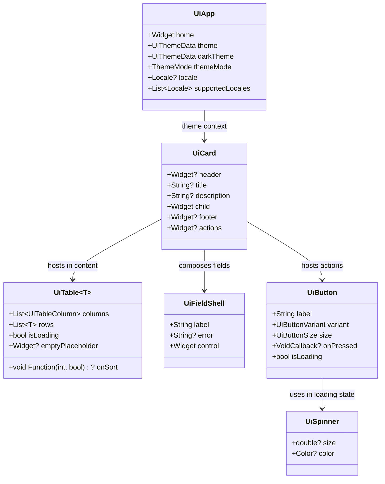

# Phase 02 — Public Component Architecture & API Specification (Revised)

**Package:** `packages/nexabiz_ui` (NexaBiz UI Foundation)  
**Author:** Principal Flutter Architect, Design System Engineer and Reusable Package Architect  
**Status:** Approved Architectural Specification (Updated for Step 01-B)  

---

## 1. Architectural Principles & Encapsulation Contract

NexaBiz UI provides a unified, enterprise-grade design system for administrative, back-office, and ERP applications.

### 1.1. Core Directives
1. **Zero Leaked Types (Guard G15):** Every public class, enum, callback, controller, and parameter must be defined in `nexabiz_ui` or core Flutter (`dart:ui`, `package:flutter/widgets.dart`, `package:flutter/material.dart` only where specifically approved like `DateTimeRange`). Upstream types (`shadcn.Button`, `shadcn.CheckboxState`, `shadcn.SliderValue`, `shadcn.ThemeData`, `shadcn.TableSize`) are strictly prohibited from appearing in public signatures.
2. **NexaBiz Vocabulary:** All components use the `Ui*` prefix (e.g. `UiButton`, `UiCard`, `UiTable`, `UiTabs`).
3. **Canonical Field Shell:** All form inputs (text, choice, binary, dates) consistently compose with `UiFieldShell` for label, required indicator, description, helper text, and accessible error live regions.
4. **Caller Ownership:** Validation, controllers, and collection state belong to the caller. The UI component reflects state and reports changes without internal mutation.
5. **No Monolithic Page Templates (Guards G8 & G14):** NexaBiz UI provides generic, composable primitives (`UiContent`, `UiSection`, `UiCard`, `UiTable`, `UiTabs`, `UiFormLayout`). Rigid page templates (`UiPage`, `UiScaffold`, `UiFormPage`, `UiListPage`) are strictly prohibited. Applications compose their own page layouts.
6. **No State/Router Coupling (Guard G4):** NexaBiz UI has zero dependencies on routing (`go_router`) or global state management (`riverpod`, `bloc`, `provider`).



---

## 2. Pillar 1: Buttons, Icons & Action Controls

### 2.1. `UiButton` & `UiSpinner`
Unified action trigger replacing upstream `PrimaryButton`, `OutlineButton`, `GhostButton`, and `DestructiveButton`.

> **Dependency Ordering Correction:** `UiSpinner` is co-delivered with `UiButton` in Step 02 as the foundational indicator primitive, ensuring `UiButton.isLoading` has its prerequisite satisfied immediately without mock dependencies.

```dart
enum UiButtonVariant {
  primary,
  secondary, // Outline
  ghost,     // Borderless subtle
  destructive,
  link,
}

enum UiButtonSize {
  sm,
  md,
  lg,
}

class UiButton extends StatelessWidget {
  const UiButton({
    super.key,
    required this.label,
    this.onPressed,
    this.variant = UiButtonVariant.primary,
    this.size = UiButtonSize.md,
    this.leadingIcon,
    this.trailingIcon,
    this.isLoading = false,
    this.loadingSemanticLabel,
    this.enabled = true,
  });

  const UiButton.outline({
    super.key,
    required this.label,
    this.onPressed,
    this.size = UiButtonSize.md,
    this.leadingIcon,
    this.trailingIcon,
    this.isLoading = false,
    this.loadingSemanticLabel,
    this.enabled = true,
  }) : variant = UiButtonVariant.secondary;

  const UiButton.ghost({
    super.key,
    required this.label,
    this.onPressed,
    this.size = UiButtonSize.md,
    this.leadingIcon,
    this.trailingIcon,
    this.isLoading = false,
    this.loadingSemanticLabel,
    this.enabled = true,
  }) : variant = UiButtonVariant.ghost;

  const UiButton.destructive({
    super.key,
    required this.label,
    this.onPressed,
    this.size = UiButtonSize.md,
    this.leadingIcon,
    this.trailingIcon,
    this.isLoading = false,
    this.loadingSemanticLabel,
    this.enabled = true,
  }) : variant = UiButtonVariant.destructive;

  final String label;
  final VoidCallback? onPressed;
  final UiButtonVariant variant;
  final UiButtonSize size;
  final Widget? leadingIcon;
  final Widget? trailingIcon;
  final bool isLoading;
  final String? loadingSemanticLabel;
  final bool enabled;
}
```

### 2.2. `UiIconButton`
Accessible icon action trigger. Requires semantic labeling for screen readers.

```dart
class UiIconButton extends StatelessWidget {
  const UiIconButton({
    super.key,
    required this.icon,
    required this.semanticLabel,
    this.onPressed,
    this.tooltip,
    this.variant = UiButtonVariant.ghost,
    this.size = UiButtonSize.md,
    this.enabled = true,
  });

  final Widget icon;
  final String semanticLabel;
  final VoidCallback? onPressed;
  final String? tooltip;
  final UiButtonVariant variant;
  final UiButtonSize size;
  final bool enabled;
}
```

### 2.3. `UiSpinner`
Compact indeterminate progress spinner used in loading buttons and inline progress states.

```dart
class UiSpinner extends StatelessWidget {
  const UiSpinner({
    super.key,
    this.size,
    this.color,
    this.semanticLabel,
  });

  final double? size;
  final Color? color;
  final String? semanticLabel;
}
```

The consuming application supplies localized accessibility text. A loading
button retains `label` as its accessible name when `loadingSemanticLabel` is
omitted. A standalone spinner has no generated English label; callers may
provide `semanticLabel`. The nested spinner in a loading button is excluded
from semantics to prevent duplicate progress announcements.

---

## 3. Pillar 2: Surfaces, Badges, Separators & Display Elements

### 3.1. `UiCard`
Structured container surface for records, dashboard widgets, and grouped forms. Composes structured slots rather than being a bare surface.

```dart
class UiCard extends StatelessWidget {
  const UiCard({
    super.key,
    required this.child,
    this.title,
    this.description,
    this.header,
    this.footer,
    this.actions,
    this.padding,
    this.filled = false,
  });

  final Widget child;
  final String? title;
  final String? description;
  final Widget? header;
  final Widget? footer;
  final Widget? actions;
  final EdgeInsetsGeometry? padding;
  final bool filled;
}
```

### 3.2. `UiBadge`
Compact metadata and status indicators.

```dart
enum UiBadgeVariant {
  primary,
  secondary,
  outline,
  destructive,
}

class UiBadge extends StatelessWidget {
  const UiBadge({
    super.key,
    required this.label,
    this.variant = UiBadgeVariant.primary,
    this.leadingIcon,
  });

  final String label;
  final UiBadgeVariant variant;
  final Widget? leadingIcon;
}
```

### 3.3. `UiChip`
Interactive compact chip for filters, selected tags, and recipient pills.

```dart
class UiChip extends StatelessWidget {
  const UiChip({
    super.key,
    required this.label,
    this.leading,
    this.trailing,
    this.onPressed,
    this.onDeleted,
    this.enabled = true,
    this.deleteSemanticLabel,
  });

  final Widget label;
  final Widget? leading;
  final Widget? trailing;
  final VoidCallback? onPressed;
  final VoidCallback? onDeleted;
  final bool enabled;
  /// Required and non-empty whenever [onDeleted] is supplied.
  final String? deleteSemanticLabel;
}
```

### 3.4. `UiDivider`
Accessible divider separating content sections or toolbars.

```dart
enum UiDividerOrientation { horizontal, vertical }

class UiDivider extends StatelessWidget {
  const UiDivider({
    super.key,
    this.orientation = UiDividerOrientation.horizontal,
    this.margin,
    this.thickness,
    this.semanticLabel,
  });

  final UiDividerOrientation orientation;
  final EdgeInsetsGeometry? margin;
  final double? thickness;
  /// Decorative when omitted; otherwise announces caller-supplied text.
  final String? semanticLabel;
}
```

### 3.5. `UiAvatar` & `UiTooltip`

```dart
enum UiAvatarSize { sm, md, lg }

class UiAvatar extends StatelessWidget {
  const UiAvatar({
    super.key,
    required this.name,
    this.image,
    this.size = UiAvatarSize.md,
    this.semanticLabel,
  });

  final String name;
  final ImageProvider? image;
  final UiAvatarSize size;
  final String? semanticLabel;
}

class UiTooltip extends StatefulWidget {
  const UiTooltip({
    super.key,
    required this.child,
    required this.message,
    this.waitDuration = const Duration(milliseconds: 500),
  });

  final Widget child;
  final String message;
  final Duration waitDuration;
}
```

Avatar sizes are `sm` 32px, `md` 40px and `lg` 48px. Initials are derived from the caller's name without an English placeholder. Its accessible description is `semanticLabel ?? name`. The tooltip message is caller-localized, shown on delayed hover, keyboard focus or touch long-press, and dismissed on exit, Escape, outside tap or unmount. No upstream type is exported.

---

## 4. Pillar 3: Binary & Choice Form Inputs

All choice inputs provide both a **standalone control** and a paired **form field wrapper** (`*Field`) integrating with `UiFieldShell`.

### 4.1. `UiCheckbox` & `UiCheckboxField` (Strict Type Isolation)
> **Upstream Encapsulation Guarantee:** Upstream `Checkbox` exposes `CheckboxState` (`checked`, `unchecked`, `indeterminate`). `UiCheckbox` **strictly hides** `CheckboxState`. It exposes standard Flutter `bool? value` and `ValueChanged<bool?>? onChanged`.
> - `true` ↔ `CheckboxState.checked`
> - `false` ↔ `CheckboxState.unchecked`
> - `null` ↔ `CheckboxState.indeterminate`

```dart
class UiCheckbox extends StatelessWidget {
  const UiCheckbox({
    super.key,
    required this.value,
    required this.onChanged,
    this.tristate = false,
    this.enabled = true,
    this.semanticLabel,
  });

  final bool? value;
  final ValueChanged<bool?>? onChanged;
  final bool tristate;
  final bool enabled;
  final String? semanticLabel;
}

class UiCheckboxField extends StatelessWidget {
  const UiCheckboxField({
    super.key,
    required this.label,
    required this.value,
    required this.onChanged,
    this.description,
    this.helper,
    this.error,
    this.tristate = false,
    this.enabled = true,
    this.readOnly = false,
  });

  final String label;
  final bool? value;
  final ValueChanged<bool?>? onChanged;
  final String? description;
  final String? helper;
  final String? error;
  final bool tristate;
  final bool enabled;
  final bool readOnly;
}
```

### 4.2. `UiSwitch` & `UiSwitchField`
Boolean toggle for settings and feature activation.

```dart
class UiSwitch extends StatelessWidget {
  const UiSwitch({
    super.key,
    required this.value,
    required this.onChanged,
    this.enabled = true,
    this.semanticLabel,
  });

  final bool value;
  final ValueChanged<bool>? onChanged;
  final bool enabled;
  final String? semanticLabel;
}

class UiSwitchField extends StatelessWidget {
  const UiSwitchField({
    super.key,
    required this.label,
    required this.value,
    required this.onChanged,
    this.description,
    this.helper,
    this.error,
    this.enabled = true,
    this.readOnly = false,
  });

  final String label;
  final bool value;
  final ValueChanged<bool>? onChanged;
  final String? description;
  final String? helper;
  final String? error;
  final bool enabled;
  final bool readOnly;
}
```

### 4.3. `UiRadioGroup<T>` & `UiRadioGroupField<T>`
Single-choice mutually exclusive selection group.

```dart
class UiRadioOption<T> {
  const UiRadioOption({
    required this.value,
    required this.label,
    this.description,
    this.enabled = true,
  });

  final T value;
  final String label;
  final String? description;
  final bool enabled;
}

class UiRadioGroup<T> extends StatelessWidget {
  const UiRadioGroup({
    super.key,
    required this.options,
    required this.value,
    required this.onChanged,
    this.enabled = true,
    this.semanticLabel,
  });

  final List<UiRadioOption<T>> options;
  final T? value;
  final ValueChanged<T>? onChanged;
  final bool enabled;
  final String? semanticLabel;
}
```

The consuming application supplies each standalone control's accessible name
through `semanticLabel` or an appropriate ancestor semantic context. Field
variants derive their name from `UiFieldShell` and do not duplicate it.

```dart
class UiRadioGroupField<T> extends StatelessWidget {
  const UiRadioGroupField({
    super.key,
    required this.label,
    required this.options,
    required this.value,
    required this.onChanged,
    this.description,
    this.helper,
    this.error,
    this.requiredIndicator = false,
    this.enabled = true,
    this.readOnly = false,
  });

  final String label;
  final List<UiRadioOption<T>> options;
  final T? value;
  final ValueChanged<T>? onChanged;
  final String? description;
  final String? helper;
  final String? error;
  final bool requiredIndicator;
  final bool enabled;
  final bool readOnly;
}
```

### 4.4. `UiSlider` & `UiSliderField` (Strict Type Isolation)
> **Upstream Encapsulation Guarantee:** Upstream `Slider` exposes `SliderValue`. `UiSlider` **strictly hides** `SliderValue`, exposing canonical primitive `double value`, `double min`, `double max`, and `int? divisions`.

```dart
class UiSlider extends StatelessWidget {
  const UiSlider({
    super.key,
    required this.value,
    required this.onChanged,
    this.min = 0.0,
    this.max = 1.0,
    this.divisions,
    this.enabled = true,
    this.semanticLabel,
    this.semanticValue,
  });

  final double value;
  final ValueChanged<double>? onChanged;
  final double min;
  final double max;
  final int? divisions;
  final bool enabled;
  final String? semanticLabel;
  final String? semanticValue;
}
```

The application supplies localized `semanticValue` text. The optional visible
`valueLabel` on the field is independent and is not re-announced as the slider's
accessible value. Neither value is automatically formatted by the package.

```dart
class UiSliderField extends StatelessWidget {
  const UiSliderField({
    super.key,
    required this.label,
    required this.value,
    required this.onChanged,
    this.min = 0,
    this.max = 1,
    this.divisions,
    this.description,
    this.helper,
    this.error,
    this.valueLabel,
    this.semanticValue,
    this.requiredIndicator = false,
    this.enabled = true,
    this.readOnly = false,
  });

  final String label;
  final double value;
  final ValueChanged<double>? onChanged;
  final double min;
  final double max;
  final int? divisions;
  final String? description;
  final String? helper;
  final String? error;
  final String? valueLabel;
  final String? semanticValue;
  final bool requiredIndicator;
  final bool enabled;
  final bool readOnly;
}
```

---

## 5. Pillar 4: Dialogs, Sheets, Popovers & Notifications

### 5.1. Modal Dialogs (`showUiModalDialog`)
General-purpose modal presentation expanding upon Phase 01's `showUiConfirmationDialog`.

```dart
Future<T?> showUiModalDialog<T>({
  required BuildContext context,
  required String title,
  String? description,
  required Widget child,
  List<Widget>? actions,
  bool barrierDismissible = true,
});
```

### 5.2. Contextual Sheets / Drawers (`showUiDrawerSheet`)
Side panel overlay anchored to the window overlay for record inspection, filters, or sub-tasks.

```dart
enum UiDrawerPosition { left, right }

Future<T?> showUiDrawerSheet<T>({
  required BuildContext context,
  required String title,
  required Widget child,
  UiDrawerPosition position = UiDrawerPosition.right,
  Widget? footer,
  bool isDismissible = true,
});
```

### 5.3. Transient Notifications (`showUiToast`)
Non-blocking notification banner anchored to `UiToastLayer` in the root app.

```dart
enum UiToastType {
  info,
  success,
  warning,
  destructive,
}

void showUiToast(
  BuildContext context, {
  required String title,
  String? description,
  UiToastType type = UiToastType.info,
  Duration duration = const Duration(seconds: 4),
  Widget? action,
});
```

---

## 6. Pillar 5: Navigation, Tabs, Breadcrumbs & Menus

### 6.1. `UiTabs<T>`
Segmented tab switcher for in-page navigation and views. Caller owns typed `T value`.

```dart
class UiTabItem<T> {
  const UiTabItem({
    required this.value,
    required this.label,
    this.icon,
    this.badge,
  });

  final T value;
  final String label;
  final Widget? icon;
  final String? badge;
}

class UiTabs<T> extends StatelessWidget {
  const UiTabs({
    super.key,
    required this.tabs,
    required this.value,
    required this.onChanged,
    this.expand = false,
  });

  final List<UiTabItem<T>> tabs;
  final T value;
  final ValueChanged<T> onChanged;
  final bool expand;
}
```

### 6.2. `UiBreadcrumb`
Navigation wayfinding trail with clickable segments and current item indicator.

```dart
class UiBreadcrumbItem {
  const UiBreadcrumbItem({
    required this.label,
    this.onPressed,
  });

  final String label;
  final VoidCallback? onPressed;
}

class UiBreadcrumb extends StatelessWidget {
  const UiBreadcrumb({
    super.key,
    required this.items,
  });

  final List<UiBreadcrumbItem> items;
}
```

### 6.3. `UiPagination`
Standard record navigator with current page, total pages, page numbers, and next/previous triggers.

```dart
class UiPagination extends StatelessWidget {
  const UiPagination({
    super.key,
    required this.page,
    required this.totalPages,
    required this.onPageChanged,
    this.maxPages = 3,
  });

  final int page;
  final int totalPages;
  final ValueChanged<int> onPageChanged;
  final int maxPages;
}
```

### 6.4. `showUiDropdownMenu<T>`
Contextual popup menu displaying selectable actions or filters.

```dart
class UiMenuItem<T> {
  const UiMenuItem({
    required this.value,
    required this.label,
    this.icon,
    this.destructive = false,
    this.enabled = true,
  });

  final T value;
  final String label;
  final Widget? icon;
  final bool destructive;
  final bool enabled;
}

Future<T?> showUiDropdownMenu<T>({
  required BuildContext context,
  required RelativeRect position,
  required List<UiMenuItem<T>> items,
});
```

---

## 7. Pillar 6: Tables & Data Presentation

### 7.1. `UiTable<T>`
Canonical tabular data presentation with sorting, column alignment, loading skeletons, and empty states. Completely encapsulates upstream `TableRow`, `TableCell`, `FlexTableSize`, and `TableParentData`.

```dart
class UiTableColumn<T> {
  const UiTableColumn({
    required this.header,
    required this.cellBuilder,
    this.alignment = Alignment.centerLeft,
    this.width,
    this.sortable = false,
  });

  final Widget header;
  final Widget Function(BuildContext context, T item) cellBuilder;
  final AlignmentGeometry alignment;
  final double? width;
  final bool sortable;
}

class UiTable<T> extends StatelessWidget {
  const UiTable({
    super.key,
    required this.columns,
    required this.rows,
    this.isLoading = false,
    this.sortColumnIndex,
    this.sortAscending = true,
    this.onSort,
    this.onRowTap,
    this.emptyPlaceholder,
  });

  final List<UiTableColumn<T>> columns;
  final List<T> rows;
  final bool isLoading;
  final int? sortColumnIndex;
  final bool sortAscending;
  final void Function(int columnIndex, bool ascending)? onSort;
  final ValueChanged<T>? onRowTap;
  final Widget? emptyPlaceholder;
}
```

---

## 8. Pillar 7: Shell & Application Bootstrap

### 8.1. `UiApp`
Root application widget wrapping `ShadcnApp`, theme styling, overlay layers, directionality, and text scaling. Allows eliminating direct `ShadcnApp` and `shadcn.ThemeData` from consumer code.

```dart
class UiApp extends StatelessWidget {
  const UiApp({
    super.key,
    required this.home,
    this.title = 'NexaBiz UI',
    this.theme,
    this.darkTheme,
    this.themeMode = ThemeMode.system,
    this.locale,
    this.supportedLocales = const [Locale('en'), Locale('ar')],
    this.localizationsDelegates,
    this.debugShowCheckedModeBanner = false,
  });

  final Widget home;
  final String title;
  final UiThemeData? theme;
  final UiThemeData? darkTheme;
  final ThemeMode themeMode;
  final Locale? locale;
  final Iterable<Locale> supportedLocales;
  final Iterable<LocalizationsDelegate<dynamic>>? localizationsDelegates;
  final bool debugShowCheckedModeBanner;
}
```

### 8.2. Theme Encapsulation (`UiThemeData` & `UiColorScheme`)
Provides canonical token-driven theme configuration without exposing `shadcn.ThemeData` or `shadcn.ColorSchemes`.

```dart
class UiThemeData {
  const UiThemeData({
    required this.colorScheme,
    this.brightness = Brightness.light,
  });

  factory UiThemeData.light({UiColorScheme? colorScheme}) => ...;
  factory UiThemeData.dark({UiColorScheme? colorScheme}) => ...;

  final UiColorScheme colorScheme;
  final Brightness brightness;
}
```

---

## 9. Administrative Page Composition Architecture

In accordance with Architecture Boundary Guards G8 and G14, NexaBiz UI **does not provide pre-fabricated page templates** (`UiPage`, `UiScaffold`, `UiFormPage`, etc.). Instead, consumer applications compose administrative pages using NexaBiz layout and presentation primitives.

### 9.1. Division of Responsibilities
| Layer | NexaBiz UI Foundation Responsibilities | Consumer Application Responsibilities |
|---|---|---|
| **Root Shell** | `UiApp` boots theme, typography tokens, overlay toast layer, and scaling. | Declares top-level routes, navigation state, and authentication guard. |
| **Page Layout** | Provides structural primitives: `UiContent`, `UiSection`, `UiActionGroup`, `UiCard`, `UiDivider`. | Arranges headers, sidebars, navigation bars, and scrolling wrappers (`SingleChildScrollView`, `CustomScrollView`). |
| **Data Presentation**| `UiTable<T>`, `UiTabs<T>`, `UiPagination`, `UiBadge`, `UiChip`, `UiEmptyState`, `UiErrorState`. | Fetches data, triggers async queries, manages filter state and active pagination offsets. |
| **Form Entry** | `UiFormLayout`, `UiFormSpan`, `UiTextField`, `UiNumberField`, `UiSelectField`, `UiCheckboxField`, etc. | Validates form fields, binds domain models, submits payloads, manages draft state. |
| **Overlays** | `showUiModalDialog`, `showUiDrawerSheet`, `showUiToast`, `showUiConfirmationDialog`. | Determines business triggers, confirmation text, error handlers, and dismissal flows. |

### 9.2. Canonical Composition Patterns

#### Pattern A: Dashboard Page
```dart
Column(
  crossAxisAlignment: CrossAxisAlignment.stretch,
  children: [
    UiSection(
      title: 'Business Overview',
      description: 'Real-time performance metrics and recent activity.',
      trailing: UiButton(label: 'Export Report', onPressed: _onExport),
      child: const SizedBox.shrink(),
    ),
    const SizedBox(height: UiTokens.fieldGap),
    UiFormLayout(
      columns: 4,
      children: [
        UiFormSpan(span: 1, child: UiCard(title: 'Total Revenue', child: RevenueMetric())),
        UiFormSpan(span: 1, child: UiCard(title: 'Active Users', child: UsersMetric())),
        UiFormSpan(span: 1, child: UiCard(title: 'New Orders', child: OrdersMetric())),
        UiFormSpan(span: 1, child: UiCard(title: 'Pending Issues', child: IssuesMetric())),
      ],
    ),
    const SizedBox(height: UiTokens.contentGap),
    UiCard(
      title: 'Recent Transactions',
      child: UiTable<Transaction>(columns: _columns, rows: _transactions),
    ),
  ],
)
```

#### Pattern B: List & Table Page
```dart
UiContent(
  maxWidth: null, // Full width for dense data grid
  child: Column(
    children: [
      UiSection(
        title: 'Customer Directory',
        description: 'Manage active customer accounts, credit limits, and statuses.',
        trailing: UiActionGroup(
          children: [
            UiButton.outline(label: 'Filter', leadingIcon: FilterIcon(), onPressed: _onOpenFilterDrawer),
            UiButton(label: 'Add Customer', leadingIcon: AddIcon(), onPressed: _onCreateCustomer),
          ],
        ),
        child: const SizedBox.shrink(),
      ),
      const SizedBox(height: UiTokens.fieldGap),
      UiCard(
        padding: EdgeInsets.zero,
        child: Column(
          children: [
            UiTable<Customer>(columns: _columns, rows: _pagedCustomers, isLoading: _loading),
            UiDivider(),
            Padding(
              padding: const EdgeInsets.all(UiTokens.fieldGap),
              child: UiPagination(page: _page, totalPages: _totalPages, onPageChanged: _onPageChanged),
            ),
          ],
        ),
      ),
    ],
  ),
)
```

#### Pattern C: Create / Edit Form Page
```dart
UiContent(
  maxWidth: UiTokens.formMaxWidth,
  child: Column(
    children: [
      UiSection(
        title: 'Edit Product Details',
        description: 'Update pricing, inventory, and category classification.',
        child: UiFormLayout(
          columns: 2,
          children: [
            UiFormSpan(span: 2, child: UiTextField(label: 'Product Name', controller: _nameController)),
            UiFormSpan(span: 1, child: UiNumberField(label: 'Price', controller: _priceController)),
            UiFormSpan(span: 1, child: UiSelectField<String>(label: 'Category', value: _cat, items: _cats, onChanged: _onCatChanged)),
            UiFormSpan(span: 2, child: UiSwitchField(label: 'Active in Catalog', value: _active, onChanged: _onActiveChanged)),
          ],
        ),
      ),
      const SizedBox(height: UiTokens.contentGap),
      UiActionGroup(
        alignment: WrapAlignment.end,
        children: [
          UiButton.ghost(label: 'Cancel', onPressed: _onCancel),
          UiButton(label: 'Save Changes', isLoading: _isSaving, onPressed: _onSave),
        ],
      ),
    ],
  ),
)
```

#### Pattern D: Record Detail Page
```dart
UiContent(
  maxWidth: 1200,
  child: Column(
    children: [
      UiBreadcrumb(items: [
        UiBreadcrumbItem(label: 'Orders', onPressed: _onNavOrders),
        UiBreadcrumbItem(label: 'ORD-2026-9041'),
      ]),
      const SizedBox(height: UiTokens.fieldGap),
      UiSection(
        title: 'Order ORD-2026-9041',
        description: 'Placed on 26 Sep 2026 by Acme Corp',
        trailing: UiBadge(label: 'Paid', variant: UiBadgeVariant.primary),
        child: UiTabs<String>(
          tabs: [
            UiTabItem(value: 'items', label: 'Order Items'),
            UiTabItem(value: 'shipping', label: 'Shipping & Delivery'),
            UiTabItem(value: 'audit', label: 'Audit Log'),
          ],
          value: _activeTab,
          onChanged: _onTabChanged,
        ),
      ),
      const SizedBox(height: UiTokens.fieldGap),
      _activeTab == 'items' ? OrderItemsGrid() : ShippingInfoCard(),
    ],
  ),
)
```

#### Pattern E: Master-Detail Layout
```dart
Row(
  crossAxisAlignment: CrossAxisAlignment.stretch,
  children: [
    SizedBox(
      width: 320,
      child: UiCard(
        title: 'All Invoices',
        child: ListView.builder(
          itemCount: _invoices.length,
          itemBuilder: (ctx, i) => InvoiceListTile(
            invoice: _invoices[i],
            selected: _selectedInvoice == _invoices[i],
            onTap: () => setState(() => _selectedInvoice = _invoices[i]),
          ),
        ),
      ),
    ),
    const SizedBox(width: UiTokens.contentGap),
    Expanded(
      child: _selectedInvoice == null
          ? UiEmptyState(title: 'No Invoice Selected', message: 'Select an invoice from the list to view details.')
          : InvoiceDetailView(invoice: _selectedInvoice!),
    ),
  ],
)
```

---

## 10. Localization & Accessibility Contract

### 10.1. Localization Sovereignty
1. **Zero Hardcoded Strings:** NexaBiz UI does not embed user-facing application strings. All titles, labels, helpers, and error messages are passed in by the consumer application.
2. **Open Locale Support:** `UiApp` accepts arbitrary `supportedLocales` and caller-provided `localizationsDelegates`. It does not restrict applications to English and Arabic.
3. **Internal Accessibility Labels:** Any internal non-visual accessibility labels (e.g., "Clear date", "Close dialog", "Remove tag") must be customizable via an optional `UiLocalizationConfiguration` or inherited locale provider.

### 10.2. Accessibility & Symmetry Requirements
1. **Screen Reader Semantics:** Every interactive trigger, choice field, and status badge must declare semantic traits (`button`, `header`, `selected`, `checked`, `expanded`). Live regions (`polite` / `assertive`) announce error messages dynamically.
2. **Keyboard Navigation:**
   - Action triggers activate via `Enter` and `Space`.
   - Modals and drawers dismiss on `Escape` and return focus cleanly to the trigger node.
   - Tabs and radio options traverse via arrow keys (`ArrowLeft`, `ArrowRight`, `ArrowUp`, `ArrowDown`).
3. **Large Text Scaling:** Layouts must survive `TextScaler.linear(1.5)` and `TextScaler.linear(2.0)` at viewports down to 320px width without `RenderFlex` overflows, clipping, or truncated text.
4. **RTL / LTR Symmetry:** All directional padding, alignments, animations (e.g. drawer slides), and icons adapt automatically under `TextDirection.rtl`.
