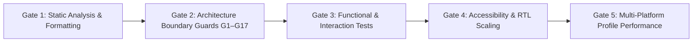

# Phase 02 — Quality & Performance Gates (Revised)

**Package:** `packages/nexabiz_ui` (NexaBiz UI Foundation)  
**Author:** Principal Flutter Architect, Performance Engineer and Release Quality Auditor  
**Status:** Approved Quality Specification (Updated for Step 01-B)  

---

## 1. Quality Gate Architecture Overview

To guarantee that Phase 02 delivers robust, enterprise-grade components without introducing architectural drift or regressions to the certified Phase 01 foundation, five mandatory quality gates must be cleared on every step:



---

## 2. Gate Specifications

### Gate 1: Static Analysis & Formatting Verification
- **Code Formatting:**
  ```bash
  dart format --output=none --set-exit-if-changed .
  ```
  Must pass with Exit Code 0 across all files in `lib/`, `test/`, and `benchmark/`.
- **Static Analysis:**
  ```bash
  flutter analyze --no-pub packages/nexabiz_ui
  flutter analyze --no-pub .
  ```
  Must pass with Exit Code 0 and **zero warnings, zero errors, and zero linter issues**.

### Gate 2: Architecture Boundary Guards (G1–G17)
The architecture boundary guards in `test/architecture/boundary_test.dart` will be strictly enforced:
- **G1 (Generic Foundation):** Zero domain or application imports inside `packages/nexabiz_ui/lib`.
- **G2 (Workbench Decoupling):** Upgraded in Step 10 to assert that `lib/main.dart` contains **zero imports of `package:shadcn_flutter`**.
- **G3 (Public Barrel Review):** Barrel file `lib/nexabiz_ui.dart` must export only approved, reviewed symbols using explicit `show` lists.
- **G4 (Zero State/Router Dependencies):** Banned dependencies (`flutter_riverpod`, `go_router`, `provider`, `bloc`) remain strictly excluded.
- **G5 (Zero Viewport Scaling Dependencies):** Banned packages (`flutter_screenutil`, `sizer`, `responsive_framework`) remain excluded.
- **G6 (Minimal Dependency Graph):** Dependencies remain restricted to `flutter` and pinned `shadcn_flutter: 0.0.53`.
- **G7 (Visual Authority):** Material imports restricted exclusively to show-only `DateTimeRange` in `date_range_field.dart`.
- **G8 (Anti-Wrapper Guard):** Prohibits declaring rename-only visual wrappers or monolithic page templates (`class UiPage`, `class UiScaffold`, `class UiScreen`).
- **G9 (Layout Safety):** Prohibits `IntrinsicWidth` and `IntrinsicHeight` layout passes in `packages/nexabiz_ui/lib`.
- **G10 (Validation Engine Isolation):** Foundation must not own `FormState` or validation engines.
- **G11 (Scroll Isolation):** Form layout primitives must not own scrolling.
- **G12 (Unconstrained Host Safety):** Top-level `Expanded` prohibited inside form layout primitives.
- **G13 (Lifecycle Integrity):** Prohibits global focus hacks, stored static contexts, or static navigator singletons.
- **G14 (Anti-Page-Framework Guard):** Prohibits declaring monolithic application page frameworks (`UiFormPage`, `UiListPage`, `UiDashboardPage`, etc.).
- **G15 (Type Encapsulation Scanner):** Every exported class, typedef, and method signature is verified to ensure zero upstream `shadcn.*` types leak into the public API.
- **G16 (Step 02 Accessibility):** Approved loading labels remain on all named button constructors and spinner semantics remain caller-owned.
- **G17 (Step 03 Accessibility):** Approved chip, divider, avatar and tooltip localization parameters remain present, with no private upstream implementation import in the tooltip adapter.

### Gate 3: Functional & Interaction Test Coverage
Every new component must provide a dedicated test suite verifying:
1. **Pointer Interaction:** Triggers and options activate via real pointer events (`tester.tap`), not direct callback invocations.
2. **Callback Semantics:** Emits exactly 1 callback per user interaction; 0 callbacks on programmatic parent rebuilds.
3. **State Synchronization:** `didUpdateWidget` reflects new incoming parent values without internal state desync.
4. **Lifecycle & Teardown:** Zero lingering listeners on caller-owned controllers or focus nodes after unmounting.

### Gate 4: Accessibility, Keyboard & RTL Scaling
1. **Keyboard Navigation:**
   - Action triggers activate via `Enter` and `Space`.
   - Popups, sheets, and dialogs close on `Escape` and restore focus to trigger.
   - Radio groups, tabs, and tables traverse cleanly via Arrow keys (`ArrowDown`, `ArrowUp`, `ArrowLeft`, `ArrowRight`).
2. **RTL / LTR Symmetry:**
   - Every component test runs in both `TextDirection.ltr` and `TextDirection.rtl`.
   - Icons, labels, padding, drawer animations, and badges adapt symmetrically.
3. **Large Text Scaling:**
   - Layout tested under `TextScaler.linear(1.5)` and `TextScaler.linear(2.0)` at 320px, 420px, and 960px widths.
   - Zero `RenderFlex` overflows, zero layout clipping, and zero font truncation.

### Gate 5: Multi-Platform Profile Performance

#### 5.1. Frame Budget Architecture & Realistic Thresholds
> **Total Frame Pipeline Definition:** Total Frame Time consists of:
> `Vsync Latency + Widget Build + RenderBox Layout + Paint + Compositing / Rasterization (GPU)`
> 
> A widget build duration alone **does not guarantee** meeting the 60 FPS (16.6 ms) or 120 FPS (8.3 ms) frame budget. Build durations must leave ample headroom for layout, paint, and rasterization.

The per-component profile build budgets are defined as follows:
1. **Atomic Controls (`UiButton`, `UiBadge`, `UiChip`, `UiCheckbox`, `UiSwitch`, `UiSpinner`):**
   - Single-frame build duration: **< 2.0 ms**
   - Interaction latency: **< 16.0 ms**
2. **Composite Surfaces & Navigation (`UiCard`, `UiTabs`, `UiAccordion`):**
   - Single-frame build duration: **< 4.0 ms**
3. **Complex Tabular Grids (`UiTable` with 50 populated rows):**
   - Initial build duration: **< 8.0 ms**
   - Re-sort / filter rebuild duration: **< 6.0 ms**
4. **Raster Thread Budget:**
   - Maximum raster thread time per frame: **< 8.0 ms** (leaving 8.6ms for UI thread at 60Hz).

#### 5.2. Multi-Platform Statistical Protocol
- **Platform Separation:** Benchmarks must be executed and reported separately for Linux desktop and physical Android hardware (`SM-G986U`). Under no circumstances may Linux and Android results be blended into a single claim.
- **Statistical Distributions:** Every benchmark must execute a minimum of **10 iterations** and report:
  - Minimum (Min)
  - Maximum (Max)
  - Median (P50)
  - Mean
  - Standard Deviation (StdDev)

For Step 02, record button rebuild, button pointer, icon pointer, loading
transition, and spinner insertion separately. Attribute `FrameTiming` samples
carefully: an indeterminate spinner continuously schedules animation frames, so
the window's maximum build/raster values include ongoing animation work and
are not isolated constructor costs. Treat 2/16/8 ms budgets as engineering
targets rather than automatic certification.

---

## 3. Regression Safety & Baseline Protection Law

1. **Phase 01 Baseline Preservation:**
   - All 181 automated tests certified at Phase 01 Step 07 must remain passing at 100%.
   - No existing test may be weakened, commented out, or bypassed.
2. **Defect-First Protocol:**
   - Production code modifications are permitted only after reproducing an identified defect with a failing automated test.
3. **Strict Step Gating:**
   - Implementation work proceeds strictly wave-by-wave upon explicit user direction. No automatic start of subsequent steps.
