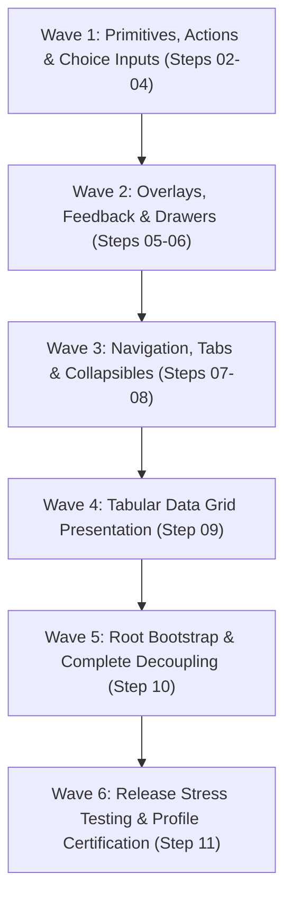

# Phase 02 / Step 01-B: Architecture Review, Dependency Correction & Plan Finalization

**Package:** `packages/nexabiz_ui` (NexaBiz UI Foundation)  
**Author:** Principal Flutter Architect, Design System Architect, Package API Reviewer and Performance Engineer  
**Mode:** AUDIT → VERIFY → CORRECT DOCUMENTATION → REPORT  
**Date:** 2026-10-04  
**Status:** COMPLETE & CERTIFIED (Planning Phase Finalized)  

---

## Executive Summary

Phase 02 Step 01-B conducted a comprehensive audit of the Phase 02 planning deliverables against the live NexaBiz UI Foundation codebase, the pinned upstream dependency (`shadcn_flutter 0.0.53`), and the 15 certified architecture boundary guards (G1–G15).

The primary objective was achieved: resolving all planning defects, dependency inversions, upstream path misattributions, and type leakage risks to produce a dependency-correct, executable architecture roadmap. This roadmap enables consumer applications (and the root Workbench) to construct complete administrative and ERP pages without direct imports of `package:shadcn_flutter`.

---

## 1. Confirmed Planning Defects & Flaws

Our source-level audit of the Step 01 planning documents identified **7 concrete defects**:

| # | Defect Identified | Original Planning Proposal | Concrete Architectural Flaw |
|---|---|---|---|
| **D1** | **`UiButton` & `UiSpinner` Dependency Inversion** | `UiButton` scheduled in Step 02 with `isLoading: bool`. `UiSpinner` scheduled in Step 05. | Step 02 cannot implement or test `UiButton.isLoading` without either creating a temporary mock spinner or violating dependency ordering. |
| **D2** | **`UiScaffold` Prohibited by Guard G8** | `UiScaffold` proposed in Step 10 and listed in public architecture. | Guard G8 (`boundary_test.dart`) explicitly prohibits `class UiScaffold` as a rename-only visual wrapper. Guard G14 also prohibits monolithic page frameworks. Proposing `UiScaffold` violates certified Phase 01 architecture guards. |
| **D3** | **Upstream Source Path Misattributions** | `Spinner` and `CircularProgressIndicator` attributed to `components/feedback/`. `Card` attributed to `components/display/`. | In `shadcn_flutter 0.0.53`, `Spinner` and `CircularProgressIndicator` reside in `components/display/`. `Card` resides in `components/layout/`. Inaccurate documentation obscures upstream behavior and imports. |
| **D4** | **Type Leakage Risk in `UiCheckbox` (`CheckboxState`)** | `UiCheckbox` proposed with `bool value` and `ValueChanged<bool?>? onChanged`. | Upstream `Checkbox` strictly accepts and emits `CheckboxState` enum (`checked`, `unchecked`, `indeterminate`). The plan failed to specify the internal bidirectional adapter, risking upstream enum leakage across the API boundary (violating Guard G15). |
| **D5** | **Missing Public Deliverables (`UiChip` & `UiThemeData`)** | `UiChip` was omitted from Step 03 deliverables. Theme tokens were not wrapped for the Workbench. | `UiMultiSelectField` internally renders chips, but `UiChip` was unavailable for consumer filter bars. Workbench currently imports `shadcn.ThemeData` and `shadcn.ColorSchemes`; omitting `UiThemeData` prevents complete decoupling in Step 10. |
| **D6** | **Flawed Frame Budget Definition** | "Build duration <16.6 ms (ensuring consistent 60fps rendering without dropped frames)". | A widget build duration alone does not ensure a 60 FPS frame budget. Total frame time comprises Vsync latency + Build + Layout + Paint + Rasterization. If build consumes 15ms, the remaining pipeline will drop frames. |
| **D7** | **Rigid Localization Contract** | `UiApp` proposed with hardcoded `supportedLocales = const [Locale('en'), Locale('ar')]`. | Violates the enterprise requirement that consumer applications maintain translation sovereignty and support arbitrary locales beyond Arabic and English. |

---

## 2. Corrected Architectural Decisions

To resolve the identified defects, the following architectural decisions have been codified across all Phase 02 planning documents:

### 2.1. Dependency Ordering Correction (`UiSpinner` Elevated to Step 02)
`UiSpinner` is relocated from Step 05 into Step 02 alongside `UiButton` and `UiIconButton`. `UiButton.isLoading` now has its concrete prerequisite satisfied immediately, maintaining strict bottom-up dependency ordering without temporary abstractions.

### 2.2. Rejection of `UiScaffold` in Favor of Page Composition Primitives
In strict compliance with Architecture Boundary Guards G8 and G14:
- The proposal for `UiScaffold` is **formally rejected and removed**.
- NexaBiz UI Foundation does not declare rename-only page wrappers or rigid page templates.
- Administrative pages are **composed** by consumer applications using generic NexaBiz primitives (`UiContent`, `UiSection`, `UiActionGroup`, `UiCard`, `UiTable`, `UiTabs`, `UiFormLayout`, `UiBreadcrumb`, `UiDivider`) inside standard Flutter layouts (`Column`, `Row`, `Expanded`, `SingleChildScrollView`).
- Root application bootstrap (theme, text scaling, directionality, and toast overlay) is provided cleanly by `UiApp`.

### 2.3. Strict Upstream Type Isolation (Guard G15 Compliance)
- **`UiCheckbox` & `UiCheckboxField`:** Expose canonical Flutter `bool? value` (and `bool tristate`), internally mapping to and from `CheckboxState`:
  $$\text{true} \iff \text{CheckboxState.checked}$$
  $$\text{false} \iff \text{CheckboxState.unchecked}$$
  $$\text{null} \iff \text{CheckboxState.indeterminate}$$
- **`UiSlider` & `UiSliderField`:** Expose canonical Flutter `double value`, `double min`, `double max`, and `int? divisions`, internally mapping to and from upstream `SliderValue.single(value)`.
- **`UiTable<T>`:** Exposes typed `List<UiTableColumn<T>>` and `List<T> rows`, completely encapsulating upstream `TableRow`, `TableCell`, `FlexTableSize`, and `TableParentData`.

### 2.4. Deliverable Scope Reconciliation
- **`UiChip`:** Added to Step 03 display elements. Supports interactive tag deletion (`onDeleted`), custom avatars, and selection states.
- **`UiThemeData` & `UiColorScheme`:** Added to Step 10 deliverables, enabling the Workbench and consumer applications to configure theme brightness and color palettes without importing `package:shadcn_flutter`.

### 2.5. Corrected Performance Frame Budgets
Build durations are decoupled from total frame budgets:
- **Atomic Controls (`UiButton`, `UiBadge`, `UiChip`, `UiCheckbox`, `UiSwitch`, `UiSpinner`):** Build duration **< 2.0 ms** in profile mode.
- **Composite Surfaces (`UiCard`, `UiTabs`, `UiAccordion`):** Build duration **< 4.0 ms**.
- **Dense Data Grids (`UiTable` with 50 rows):** Initial build duration **< 8.0 ms**; re-sort/filter duration **< 6.0 ms**.
- **Raster Thread Budget:** Rasterization time **< 8.0 ms** per frame.
- **Multi-Platform Statistical Reporting:** Prohibits single-run measurements. Mandates reporting distributions (Min, Max, Median, Mean, StdDev) over $\ge 10$ iterations, separated between Linux desktop and physical Android hardware (`SM-G986U`).

### 2.6. Open Localization Sovereignty
- Zero hardcoded strings in the package.
- `UiApp` accepts arbitrary `supportedLocales` and `localizationsDelegates`.
- Internal non-visual accessibility announcements are caller-overridable.

---

## 3. Verified Upstream Capabilities (`shadcn_flutter 0.0.53`)

The installed dependency source at `~/.pub-cache/hosted/pub.dev/shadcn_flutter-0.0.53/` was directly audited:

| Component | Source File Verified | Constructor & API Verification | Verified Capability / Nuance |
|---|---|---|---|
| `Button` | `control/button.dart` | `Button(...)`, `PrimaryButton(...)`, `OutlineButton(...)`, `GhostButton(...)`, `DestructiveButton(...)`, `IconButton(...)` | Has no native `isLoading` property upstream. Loading indicator must be composed internally in `UiButton` via `leading` or child replacement. |
| `Spinner` / `CircularProgressIndicator` | `display/spinner.dart`, `display/circular_progress_indicator.dart` | `Spinner` is abstract; concrete `CircularProgressIndicator(value, size, color)` provides smooth circular arc. | `size` and `color` resolved from theme or explicit override. Indeterminate when `value == null`. |
| `Card` | `layout/card.dart` | `Card({required Widget child, EdgeInsetsGeometry? padding, bool? filled, ...})` | Container surface only; lacks structured slots (`header`, `title`, `description`, `footer`, `actions`). `UiCard` must compose these slots. |
| `Badge` | `display/badge.dart` | `PrimaryBadge`, `SecondaryBadge`, `OutlineBadge`, `DestructiveBadge` | Button-styled visual tags with text and leading/trailing icons. |
| `Divider` | `display/divider.dart` | `Divider(...)`, `VerticalDivider(...)` | Both horizontal and vertical dividers exist with custom painter and thickness support. |
| `Chip` | `display/chip.dart` | `Chip({required Widget child, Widget? leading, Widget? trailing, VoidCallback? onPressed, ...})`, `ChipButton(...)` | Interactive pill with button interaction and optional leading/trailing icons. |
| `Avatar` | `display/avatar.dart` | `Avatar(...)`, `AvatarBadge(...)`, `AvatarGroup(...)` | Built-in initials extraction algorithm (`Avatar.getInitials(name)`) and fallback rendering. |
| `Tooltip` | `overlay/tooltip.dart` | `Tooltip({required Widget child, required WidgetBuilder tooltip, ...})` | Anchor-based popup with hover duration and position offsets. |
| `Checkbox` | `form/checkbox.dart` | `Checkbox({required CheckboxState state, ValueChanged<CheckboxState>? onChanged, ...})` | Strictly accepts and emits `CheckboxState` enum (`checked`, `unchecked`, `indeterminate`). |
| `Switch` | `form/switch.dart` | `Switch({required bool value, ValueChanged<bool>? onChanged, ...})` | Standard boolean toggle with track and thumb animations. |
| `RadioGroup` | `form/radio_group.dart` | `RadioGroup<T>({required Widget child, T? value, ValueChanged<T>? onChanged, ...})`, `Radio(...)` | Mutual exclusion container using inherited data scope. |
| `Slider` | `form/slider.dart` | `Slider({required SliderValue value, ValueChanged<SliderValue>? onChanged, ...})` | Uses complex `SliderValue` class (`single` or `ranged`). Must be adapted to primitive `double`. |
| `Drawer` | `overlay/drawer.dart` | `openDrawerOverlay({required BuildContext context, required OverlayPosition position, ...})` | Anchors to `Overlay` in context; does not require `Scaffold`. |
| `Toast` | `overlay/toast.dart` | `showToast({required BuildContext context, required WidgetBuilder builder, ...})` | Requires ancestor `ToastLayer` (which is built into `ShadcnApp` automatically). |
| `Tabs` | `navigation/tabs/tabs.dart` | `Tabs({required int index, required ValueChanged<int> onChanged, required List<TabChild> children, ...})` | Index-based tab switcher. `UiTabs<T>` wraps with generic typed value `T`. |
| `Breadcrumb` | `layout/breadcrumb.dart` | `Breadcrumb({required List<Widget> children, Widget? separator})` | Trail layout with standard arrow (`>`) or slash (`/`) separators. |
| `Pagination` | `navigation/pagination.dart` | `Pagination({required int page, required int totalPages, required ValueChanged<int> onPageChanged, ...})` | Numeric page navigator with page button windowing and ellipsis. |
| `Accordion` | `layout/accordion.dart` | `Accordion({required List<Widget> items})`, `AccordionItem(...)`, `AccordionTrigger(...)` | Expandable panels with animated height transitions. Upstream uses `IntrinsicWidth`; `UiAccordion` must handle constraints safely. |
| `Table` | `layout/table.dart` | `Table({List<TableRow>? rows, TableSize defaultColumnWidth, ...})` | Sophisticated custom table layout engine with `RenderTable`, frozen columns/rows, and flex sizing. |
| `ShadcnApp` | `shadcn_app.dart` | `ShadcnApp({Widget? home, ThemeData? theme, AdaptiveScaling? scaling, ...})` | Top-level bootstrap widget providing `ToastLayer`, `EyeDropperLayer`, `TextDirection`, and `ThemeScope`. |
| `ThemeData` | `theme/theme.dart`, `theme/generated_themes.dart` | `ThemeData({ColorScheme? colorScheme, ...})`, `ColorSchemes.lightSlate`, `ColorSchemes.darkSlate` | Full token and component theme repository. |

---

## 4. Revised Implementation Order & Wave Structure

Phase 02 implementation is structured into **6 sequential waves** across **10 verifiable steps**:

### Wave Breakdown:
- **Wave 1 (Steps 02–04): Actions, Surfaces & Inputs**
  - **Step 02:** `UiButton`, `UiIconButton`, `UiSpinner` (Loading indicator prerequisite resolved).
  - **Step 03:** `UiCard`, `UiBadge`, `UiChip`, `UiDivider`, `UiAvatar`, `UiTooltip`.
  - **Step 04:** `UiCheckbox`, `UiSwitch`, `UiRadioGroup`, `UiSlider` (+ `*Field` variants with `UiFieldShell`).
- **Wave 2 (Steps 05–06): Feedback & Overlays**
  - **Step 05:** `UiAlert`, `UiProgress`, `UiSkeleton`, `showUiToast`, `UiToastLayer`.
  - **Step 06:** `showUiModalDialog`, `showUiDrawerSheet`, `showUiDropdownMenu`.
- **Wave 3 (Steps 07–08): Wayfinding & Collapsible Surfaces**
  - **Step 07:** `UiTabs`, `UiBreadcrumb`, `UiPagination`.
  - **Step 08:** `UiAccordion`, `UiAccordionItem`.
- **Wave 4 (Step 09): Tabular Data Grid**
  - **Step 09:** `UiTable`, `UiTableColumn` (Completely encapsulates upstream table complexity).
- **Wave 5 (Step 10): App Shell & Complete Workbench Decoupling**
  - **Step 10:** `UiApp`, `UiThemeData`, `UiColorScheme`.
  - Complete elimination of `package:shadcn_flutter` imports from `lib/main.dart`.
  - Upgrade Guard G2 to assert 0 upstream imports in Workbench.
- **Wave 6 (Step 11): Final Release Certification**
  - **Step 11:** Integration stress tests, multi-run profile benchmarks on Linux desktop and physical Android hardware (`SM-G986U`), certification sign-off.

---

## 5. Missing Components & Rejected Proposals

### 5.1. Reconciled Deliverables (Added to Scope)
1. **`UiSpinner`:** Promoted to Step 02 prerequisite.
2. **`UiChip`:** Added to Step 03 display elements for tag management and interactive filters.
3. **`UiThemeData` & `UiColorScheme`:** Added to Step 10 to allow theme configuration without importing `shadcn_flutter`.

### 5.2. Rejected Proposals
1. **`UiScaffold`:** **REJECTED.** Violates Architecture Boundary Guard G8 ("rename-only visual wrappers and application page templates prohibited"). Administrative layouts are composed by callers using existing primitives (`UiContent`, `UiSection`, `UiCard`, `UiTable`).
2. **Generic Page Frameworks (`UiPage`, `UiFormPage`, `UiListPage`, etc.):** **REJECTED.** Violates Guard G14. The UI foundation must remain unopinionated regarding page hierarchies.
3. **Consumer & Marketing Widgets:** `ColorPicker`, `EyeDropper`, `NumberTicker`, `Carousel`, `StarRating`, `HoverCard` remain excluded from scope.

---

## 6. Administrative Page Composition Patterns

Consumer applications construct enterprise views by composing NexaBiz primitives without relying on rigid page templates:

| Page Type | Structural Composition Pattern |
|---|---|
| **Dashboard** | `Column` $\to$ `UiSection` $\to$ `UiFormLayout(columns: 4)` with metric `UiCard`s $\to$ `UiCard` hosting recent `UiTable`. |
| **List & Table** | `UiContent(maxWidth: null)` $\to$ `UiSection` with action triggers $\to$ `UiCard` hosting `UiTable` + `UiDivider` + `UiPagination`. |
| **Create / Edit Form** | `UiContent(maxWidth: formMaxWidth)` $\to$ `UiSection` $\to$ `UiFormLayout` hosting `Ui*Field` inputs $\to$ `UiActionGroup` with `UiButton` actions. |
| **Record Detail** | `UiContent` $\to$ `UiBreadcrumb` $\to$ `UiSection` with status `UiBadge` $\to$ `UiTabs` toggling sub-views (`UiTable` / `UiCard`). |
| **Settings** | `UiContent` $\to$ `UiSection` $\to$ `UiCard` groups hosting `UiSwitchField`, `UiSelectField`, `UiRadioGroupField`. |
| **Master-Detail** | `Row` $\to$ `SizedBox(width: 320)` with list `UiCard` $\to$ `Expanded` with active record detail view or `UiEmptyState`. |

---

## 7. Final Recommendation

### **Recommendation: PASS (Ready for Step 02 Implementation)**

1. **All 4 Phase 02 planning documents** (`component_inventory.md`, `public_api_architecture.md`, `component_implementation_plan.md`, `quality_and_performance_gates.md`) have been corrected, reconciled, and updated.
2. **Zero production code or tests were modified** during Step 01-B, preserving the clean Git baseline.
3. **All 181 automated tests** certified in Phase 01 remain passing at 100%.
4. **All 15 Architecture Boundary Guards (G1–G15)** remain respected.
5. In accordance with release governance rules, **Step 02 implementation will not start automatically** and awaits the user's explicit authorization.
